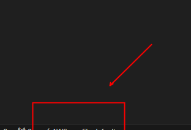

# AWS SERVERLESS API

---
This project provides a basic REST API to store information about books in a DynamoDB database using AWS API Gateway and Lambda. The API exposes a single endpoint, which receives data from a book via a POST method and stores it in DynamoDB.

The main elements of the implementation are:

#### AWS API Gateway:
It acts as an entry point for API requests.
#### AWS Lambda:
It processes the requests, extracts the provided data and stores it in DynamoDB.
#### AWS DynamoDB:
NoSQL database that stores the ledger records.

##### This architecture ensures a scalable and serverless system, ideal for handling basic data storage with high availability and low maintenance cost.

### Requirements
* AWS CLI configured.
* Necessary permissions in IAM for API Gateway, Lambda and DynamoDB.
* Node.js or Python to develop the Lambda function.

### Estructura del Proyecto
* API Gateway: Configured to expose a public endpoint (POST) that receives the book data.
* Lambda Function: Function that receives the HTTP request, extracts the book information and stores it in DynamoDB.
* DynamoDB: Table configured to store the book records.

### Endpoint de la API
Method: POST
Path: /api/v1/books
Request Body: JSON with book details (e.g. title, author, year of publication, genre).
Response: confirmation message and success or error status.
Example Request:

POST /api/v1/libros
```json
{
  "title": "Book Example",
  "author": "Author Example",
  "publication_year": 2023,
  "genre": "Fiction"
}
```

### Configuration and Implementation
1) Create a new user from AWS IAM


2) Create access keys


3) Install VS Code extension



4) Create or modify user credentials


5) Download & install AWS CLI
descargar e instalar el AWS CLI y AWS SAM (Serverless Application Model)
https://docs.aws.amazon.com/cli/latest/userguide/getting-started-install.html
https://docs.aws.amazon.com/serverless-application-model/latest/developerguide/install-sam-cli.html#install-sam-cli-instructions

6) Start a new project


7) Connect AWS services


Your “api.yml” and “Infrastructure composer” files are synchronized.

8) Clean the src and change the file extension “index.js” to “index.mjs”.


9) Paste the following code in “index.mjs”.

```javascript
import { DynamoDBClient } from "@aws-sdk/client-dynamodb";
import { DynamoDBDocumentClient, PutCommand } from "@aws-sdk/lib-dynamodb";

const ddbDocClient = DynamoDBDocumentClient.from(new DynamoDBClient({}));

export const handler = async (event) => {
  try {
    const book = JSON.parse(event.body);

    const newBook = {
      ...book,
      id: book.id ?? crypto.randomUUID(),
    };
    await ddbDocClient.send(
      new PutCommand({
        TableName: process.env.BOOKS_TABLE_NAME,
        Item: newBook,
      })
    );

    return {
      statusCode: 201,
      body: JSON.stringify(newBook),
    };
  } catch (error) {
    console.error(error);
    return {
      statusCode: 500,
      body: JSON.stringify({ message: error.message }),
    };
  }
};
```

10) Synchronize services for deployment


Set time zone parameters


Stack name


S3 bucket name


"OK" to finish


You can create the bucket manually


Successfully created


Infra sync completed


11) Copy query url


From Postman we can prove it


In DynamoDB we can observe the results

